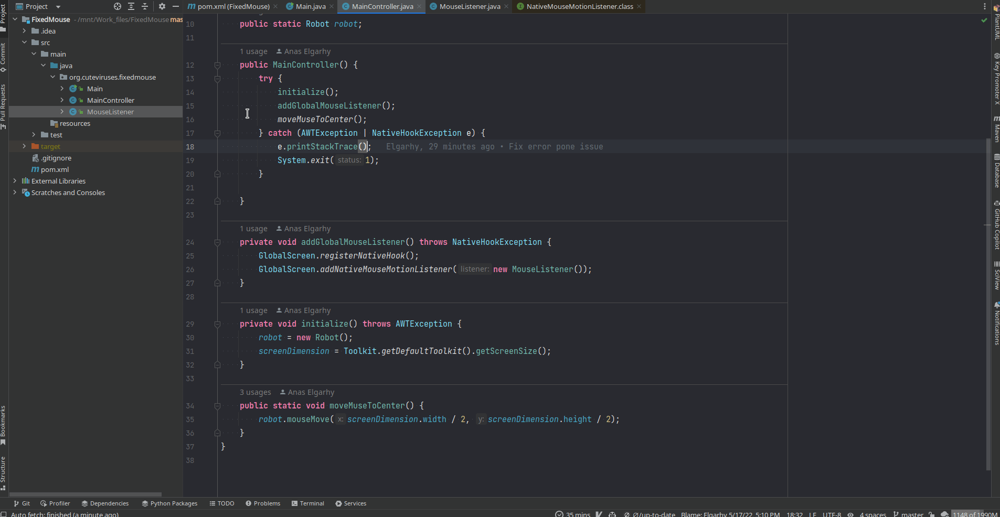

# Fixed mouse
This cute program installs the mouse pointer of the victim (client*) no more.

> Warning: There is no way to stop after start except by shutting down the device or using the task manager, using the keyboard :)

## Operating Systems supported
- Linux
- Windows
- MacOS

> We are not responsible for any use outside the framework of study and research, and I am not responsible for any damage resulting from any use outside this framework or resulting from use without sufficient experience and training.

#### License: GPLv3